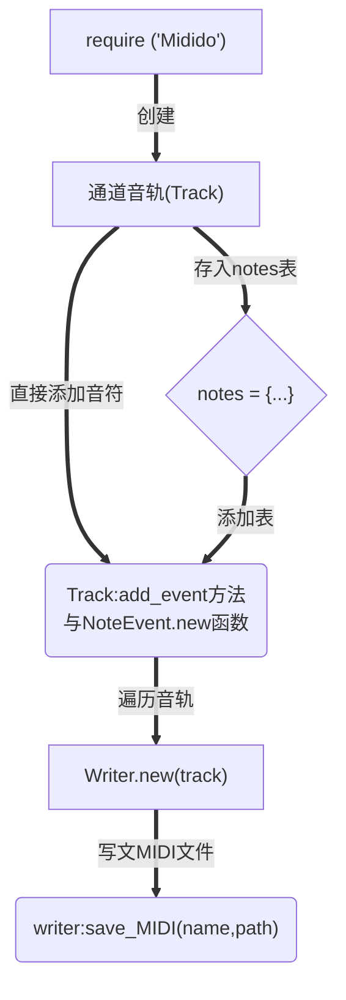

# Midido User wiki

> Midido ♫¶
> 一个用于读写MIDI文件，且具有十分友好的API的Lua扩库。它提供的MIDI数据是完全抽象的，因此并不需要用户担心那些诸如增量时间(Delta Time)和音符信号(NoteOn/NoteOff)这样的技术问题。它的方法是直观且具体的，同时对象数据也具有良好的可读性。 值得一提的是——这个扩展库不需要 任何 依赖。
> 编写和翻译它的初衷是为了让大家都能尝试以一种更加方便的方法写出自己的乐谱，人人都是作曲家，都能享受音乐的魅力。

这里是Midido的API介绍wiki，你可以在这里知晓Midido绝大部分API的用途、原理，以便在编写乐谱脚本时能更快更准确的达到自己想要的效果。废话就不多说了，让我们快点开始吧~

需要注意的是，本文主要针对那些有一定 `Lua` 编写基础的脚本作者，同时我也十分希望这些作者在阅读完本教程后能够尝试着写写自己的 `midi` 乐谱，并为乐谱库作出一些贡献。

## 1. 开始，安装和调用



那么在使用前，你需要将脚本全部解压至 `DiceQQ\plugin\` 目录下，或者 `Diceki\lua\` 也可以，但这边特别推荐放在 `DiceQQ\plugin\` 目录下，因为这涉及到生成文件的路径问题，同时本教程的示例代码也是根据 `DiceQQ\plugin\` 目录来编写的。

调用：

```lua
local Midido = require ('Midido')
```

## 2. 编写一个简单的(单音轨)脚本

那么现在来编写一个简单的生成midi的脚本吧~
新建 `test1.lua`文件，将下面的代码复制粘贴进去，保存，随后使用 `.system load`命令重载。
在重载时 `test1.lua`会被执行，将在 `DiceQQ\plugin\Midido\project\` 文件夹生成 `test1.mid` 文件。

```lua
local Midido = require ('Midido')
local Track = Midido.Track
local NoteEvent = Midido.NoteEvent
local Writer = Midido.Writer

-- 创建通道音轨(Track)实例
local track = Track.new()

-- 将音符存为notes表中的键值(必须是指定的八度音阶音符)
local notes = {'C3', 'D3', 'E3', 'F3', 'G3', 'A3', 'B3', 'C4'}

-- 将音符添加到音轨
track:add_events(NoteEvent.new({pitch = notes, sequential = true}))

-- 遍历音轨
local writer = Writer.new(track)

-- 在`Midido\project\`内生成一个名为《test1》的 MIDI 文件
writer:save_MIDI('test1',getDiceDir().."\\plugin\\Midido\\project")
```

> ~~由于代码中已经有一些注释，因此不需要对其再进行解释说明。 这是 MIDI 文件构建的基本步骤。~~

## 3. 剖析、分解示例脚本

通过运行上述脚本，我们已经知晓了MIDI 文件构建的最基本步骤：

    1. 创建通道音轨.
    2. 设置音轨音符.
    3. 写入通道音轨.
    4. 写文件并导出.



为了方便理解，我们对 `test1.lua`内的API逐行说明：

### 3.1 调用主库

> `local Midido = require ('Midido')`

> Midido.lua
> 通过这个主库可以调用其它所有的库。写一个MIDI序列,无非是读取并写入的问题，因此将其它支持库均整合起来,它仅提供两个非常有用的函数:
>
> 1. `Midido.get_MIDI_tracks(path)`
>
>    > 读取MIDI序列的所有轨道,
>    > 并将它们转换为Midido的轨道实例.
>    > @string path:MIDI文件的路径.
>    > @return->由轨道组成的数组.
>    >
> 2. `Midido.add_tracks_to_MIDI(input, tracks, output)`
>
>    > 向MIDI序列写入轨道.
>    > @string input:原MIDI文件的路径.
>    > @param tracks:一个轨道实例或由轨道组成的表.
>    > @string[opt=`input`]:输出写好后的MIDI序列.
>    > @return:返回布尔值
>    >

### 3.2 主库调用的内容

> `local Track = Midido.Track`
> `local NoteEvent = Midido.NoteEvent`
> `local Writer = Midido.Writer`

> `Midido.lua` 调用了所有库，因此在 `require('Midido')` 以后可以直接赋值使用。
>
> ```lua
> Midido.Util = require 'Midido.Util'
> Midido.Chunk = require 'Midido.Chunk'
> Midido.Track = require 'Midido.Track'
> Midido.Writer = require 'Midido.Writer'
> Midido.Constants = require 'Midido.Constants'
> Midido.MetaEvent = require 'Midido.MetaEvent'
> Midido.NoteEvent = require 'Midido.NoteEvent'
> Midido.NoteOnEvent = require 'Midido.NoteOnEvent'
> Midido.NoteOffEvent = require 'Midido.NoteOffEvent'
> Midido.ArbitraryEvent = require 'Midido.ArbitraryEvent'
> Midido.ProgramChangeEvent = require 'Midido.ProgramChangeEvent'
> ```

### 3.3 创建通道音轨(Track)

> `local track = Track.new()`

> `Track.new(name)` 是 `Track.lua` 内的第一个函数，其作用是创建一条通道音轨，`@string [opt=name]`是可选参数，用于自定义音轨名称。

> 通常来说，如果没有什么特殊需求（比如设置调号拍号等），只需要使用 `Track.new()` 以及 `Track:add_events()`（此方法会在下文说明） 即可。
> 如果想知道更多内容，你可以查看 `Midido\Track.lua` ，里面有对各个函数的详细介绍。

### 3.4 添加音符到音轨

> `local notes = {'C3', 'D3', 'E3', 'F3', 'G3', 'A3', 'B3', 'C4'}`

> 将这些音的指定音名存入一个表。

> #### Q1: 可以填入那些音名？
>
> #### A1: 在 `Constans.lua` 第36-49行定义了可以使用的音名写法:

> ```lua
> local table_notes = {
>    {'C','B#'},
>    {'C#','Db'},
>    {'D'},
>    {'D#','Eb'},
>    {'E','Fb'},
>    {'F','E#'},
>    {'F#','Gb'},
>    {'G'},
>    {'G#','Ab'},
>    {'A'},
>    {'A#','Bb'},
>    {'B','Cb'},
> }
> ```

> #### Q2: 为什么存入表内？
>
> #### A2: 目的当然是为了方便以及偷懒，但从lua编写角度来说，这主要是因为 `NoteEvent.new()` 可以将表作为第一个参数使用。下面我将会介绍 `NoteEvent.new()`。

> `NoteEvent.new(fields)`

> 这是 `NoteEvent.lua` 内的第一个函数。参数 `fields` 是一个包含7个可选参数（比如pitch、sequential）和1个默认参数(`type='note'`)的表。`pitch` 即音高,放在 `Track` 内即编曲家都会描述的通道音高，它可以是一个表。`sequential`(数据信号流/时序) 是一个布尔值，为 `true` 时代表让 MIDI 数据按照每个 MIDI 设备插入音轨的顺序流经它们。
> `NoteEvent.lua` 用于并向处理 MIDI 的 NoteOn 和 NoteOff 事件，对音符的操作十分全面，如果你对此感兴趣也可以去看看源码，里面同样有十分详细的介绍、

> `track:add_events(NoteEvent.new({pitch = notes, sequential = true}))`

> 这是 `Track:add_events()` 方法，可以将事件列表（或单个事件）添加到通道音轨. 这些事件可以是 `MetaEvents`、`NoteEvents` 或 `ProgramChangeEvents`。

### 3.5 使用编辑器(Writer)遍历音轨

> `Writer.new(tracks)`

> 这是 `Writer.lua` 内的第一个函数，用于向 MIDI 文件写入通道音轨，`tracks`参数可以说单个通道音轨对象或包含多个通道音轨的表.

### 3.6 使用编辑器(Writer)生成文件

> `Writer:save_MIDI(title, directory)`

> 这是 `Writer.lua` 内的最后一个方法，用于写 MIDI 文件，其中 `title` 是文件的名字，`directory` 是可选参数，表述保存的路径。

好了，看到这里本教程的第一部分算是结束了，快写出你的第一个 MIDI 文件吧~

## 4. 附录

> 一些可能有用的信息

### 4.1 文件结构

```tree
DiceQQ
└───plugin
       │  │Midido.lua
       │
       └───Midido
              │   │Writer.lua
              │   │Util.lua
              │   │utf8.lua
              │   │Track.lua
              │   │ProgramChangeEvent.lua
              │   │NoteOnEvent.lua
              │   │NoteOffEvent.lua
              │   │NoteEvent.lua
              │   │MetaEvent.lua
              │   │Constants.lua
              │   │Chunk.lua
              │   │ArbitraryEvent.lua
              │
              └───bit
              │     │numberlua.lua
              │     │native_bitwise.lua
              │
              └───project
```

### 4.2 参考

- http://midi.teragonaudio.com/tech/midispec.htm
- http://digitalsoundandmusic.com/6-3-1-midi-smf-files
- http://midi.teragonaudio.com/tech/midispec/noteoff.htm
- http://midi.teragonaudio.com/tech/midispec/noteon.htm
- https://www.recordingblogs.com/wiki/midi-note-off-message
- https://www.rubydoc.info/gems/midilib/MIDI
- https://www.recordingblogs.com/wiki/midi-cue-point-meta-message
- https://www.sweetwater.com/insync/midi-mode/
- https://baike.baidu.com/item/MIDI/217824#3
- https://www.jianshu.com/p/6c495b51a40c
- https://www.midi.org/midi-articles/about-midi-part-3-midi-messages

> to be...